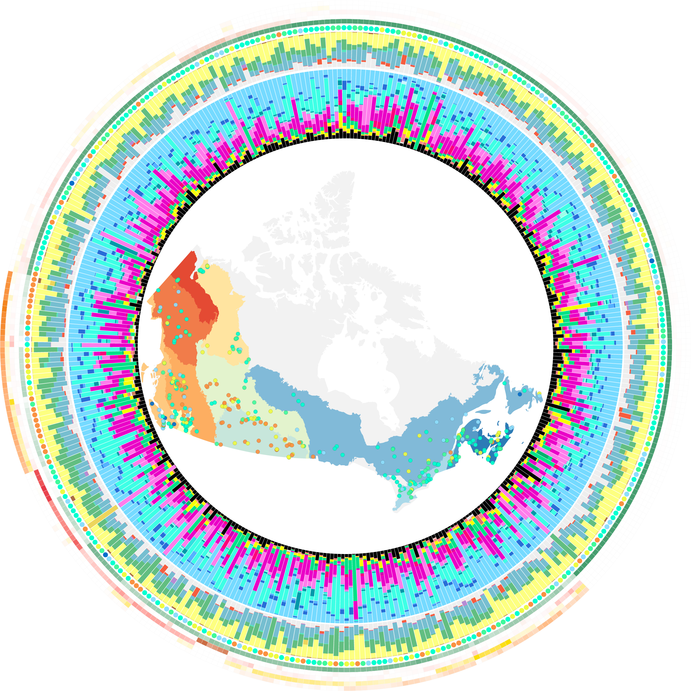

# Protist Diversity and Metabolic Strategy in Freshwater Lakes Are Shaped by Trophic State and Watershed Land Use on a Continental Scale 

Scripts associated with the article

---

Garner RE, Kraemer SA, Onana VE, Huot Y, Gregory-Eaves I, Walsh DA. 2022. Protist Diversity and Metabolic Strategy in Freshwater Lakes Are Shaped by Trophic State and Watershed Land Use on a Continental Scale. mSystems e00316-22. https://doi.org/10.1128/msystems.00316-22.

---

### Scripts

- **00_ena_template_reads.R** Format European Nucleotide Archive (ENA) read submission template.
- **00_ena_template_samples.R** Format ENA sample submission template.
- **00_palettes.R** Define palettes for figures.
- **00a_saline_lakes.R** Identify saline lakes.
- **00b_medians.R** Replace missing LakePulse environmental data with ecozone medians.
- *01_infer_asvs/*
    - **00_workflow.txt** Overview of workflow for 18S rRNA gene ASV inference.
    - **01_rename_fastq.R** Modify raw fastq file names.
    - **02_create_sample_list.R** Create list of samples.
    - **03_cutadapt.sh** Trim primers and sequencing adapters in Cutadapt.
    - **04_dada2.R** Run DADA2 pipeline on Cutadapt-trimmed reads.
- *02_curate_protists/*
    - **01_format_asvs.R** Join ASV (sequence and taxonomy) data.
    - **02_remove_spurious_asvs.R** Remove spurious sequences.
    - **03_align_asvs.txt** Align ASVs to Silva reference database in SINA.
    - **04_trim_pos.R** Trim remaining primer sequence positions.
    - **05_trim_primers.R** Remove remaining primer sequences.
    - **06_identify_protists.R** Identify ASV data assigned to protists.
    - **07_curate_samples.R** Curate samples.
- **03_trophic_functions.R** Assign trophic functional diversity.
- *04_identity_pr2/*
    - **01_insilico_pcr.txt** Perform in silico PCR with primer set on PR2 to extract 18S rRNA gene V7 region fragment.
    - **02_primer_lengths.R** Assess PR2 18S rRNA gene V7 region fragment lengths.
    - **03_blastn_asvs_pr2v7.txt** BLAST ASVs against PR2_V7 database to get sequence identity with top hit.
    - **04_percentidentity.R** Assess sequence identities between ASVs and PR2 references.
- **05_metadata.R** Curate lake environmental metadata.
- **06_phylogeny.R** Plot phylogenetic tree for protist ASVs.
- **07_phylodissim.R** Create phylogenetic dissimilarity matrices (weighted, unweighted, generalized UniFrac).
- **08_incidence.R** Assess ASV taxonomic composition and incidence across lakes.
- **09_alphadiversity.R** Perform alpha-diversity analyses.
- *10_rarefaction/*
    - **01_rarefaction_landscape.R** Compute ASV rarefaction across the landscape (all lakes).
    - **02_plot_rarefaction_landscape.R** Plot ASV rarefaction curve (landscape).
    - **03_rarefaction_lakes.R** Compute ASV rarefaction curves by lake.
    - **04_plot_rarefaction_lakes.R** Plot ASV rarefaction curves (all lakes).
- **11_accumulation.R** Plot ASV accumulation curve.
- **12_map.R** Plot sampling sites on map of Canada with ecozones.
- **13_ordinations.R** Perform ordinations (PCA, PCoA).
- **14_lcbd.R** Evaluate local contributions to beta-diversity (LCBD).
- *15_gdm/*
    - **01_gdm_bray.R** Create site-pairs for generalized dissimilarity modelling (GDM).
    - **01_gdm_genunifrac.R** Create site-pairs for generalized dissimilarity modelling (GDM).
    - **01_gdm_trophic.R** Create site-pairs for generalized dissimilarity modelling (GDM).
    - *03_gdm_permtest/* Compute GDMs using permuted variable selection.
    - **04_gdm_results.R** Summarize and visualize GDM results.
- **16_betadisper_pcoa12.R** Compute spatial medians within the first two dimensions of the ordination space.
- **17_radial_plots.R** Plot diversity and environmental data radial bar plots.
- **18_geographic_ranges.R** Calculate geographic distances for the study.
- **19_env_pca.R** Perform ordinations of environmental data.
- **20_env_histograms.R** Plot environmental data distributions.
